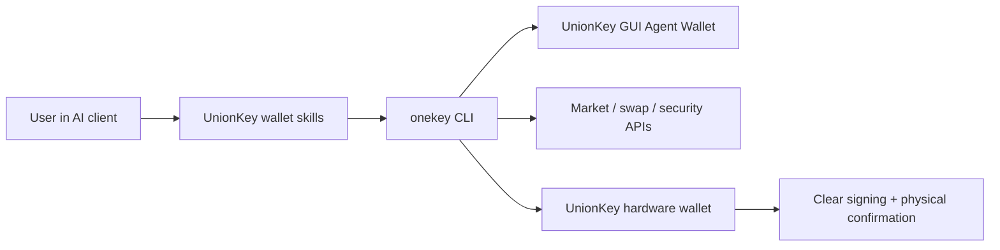

# UnionKey Agent Wallet

UnionKey Agent Wallet is the wallet layer for AI agents that need real on-chain actions, market context, and user-controlled signing. Agents can read wallet state, find receive addresses, research tokens, quote and prepare swaps, run safety checks, and hand high-risk actions back to UnionKey GUI or hardware for user confirmation.

Use this section when you are building AI agents, skills, MCP tools, automation, or command-line workflows that need wallet capability. Use Hardware SDK docs when you are integrating directly with UnionKey device transports and low-level signing APIs.

## What Agents Can Do

| Area | Agent capability | Example user request |
| --- | --- | --- |
| Wallet | Check balances, show receive addresses, inspect history, prepare transfers, derive BTC address types | `Show my ETH balance and receiving address.` |
| Swap & bridge | Quote, build, execute, track swaps, handle BTC sign-only PSBT, discover bridge networks | `Swap 1 ETH to USDC after showing me the quote.` |
| Market & research | Search tokens, fetch prices, trending lists, K-line data, liquidity, holders, quick or deep research | `What Solana tokens are trending right now?` |
| Security | Audit tokens, simulate transactions, review approvals, detect chain/address mismatch and fake contracts | `Is this token safe before I buy it?` |
| Hardware control | Connect a UnionKey device, verify authenticity, use passphrase mode, require clear signing for sensitive actions | `Use my hardware wallet for this transfer.` |
| Session control | Pair a GUI-managed Agent Wallet through App Transfer or switch to a hardware-backed session | `Connect my UnionKey Agent Wallet.` |

## How It Works

The agent talks to UnionKey through the `unionkey-wallet-skills` package and the `onekey` CLI. The user keeps control through UnionKey GUI, keyless account binding, and optional hardware confirmation.

## Choose Your Path

| Reader | Start with | Why |
| --- | --- | --- |
| Developer building an agent integration | [Capabilities](/en/agent-wallet/capabilities) and [Wallet Skills](/en/agent-wallet/wallet-skills) | Map each product capability to a schema-backed CLI command and response contract. |
| Vibe-coding user trying wallet automation | [Quickstart](/en/agent-wallet/quickstart) and [Recipes](/en/agent-wallet/recipes) | Copy natural-language prompts first, then inspect the commands behind them. |
| Security reviewer or wallet owner | [Safety Rules](/en/agent-wallet/safety) and [Hardware Control](/en/agent-wallet/hardware-control) | Confirm what agents can read, what they can execute, and when UnionKey hardware must take over. |
| Product or support teammate | [Agent Wallet Session](/en/agent-wallet/wallet-session) and [Keyless Binding](/en/agent-wallet/keyless-binding) | Understand the GUI-managed Agent Wallet, keyless account binding, and active session model. |

## Current Implementation

The public entry point is the external [`unionkey-wallet-skills`](https://github.com/UnionKeyHQ/unionkey-wallet-skills) repository. The skills support Claude Code, Codex, Cursor, OpenCode, and OpenClaw, and they route natural-language requests into wallet, swap, market, and security workflows.

The `@unionkeyfe/cli` package remains the implementation layer behind the skills. Skills use its live schema to discover supported commands and parameters, pair App Transfer or hardware-backed sessions, and keep responses structured instead of exposing raw terminal output to users.
